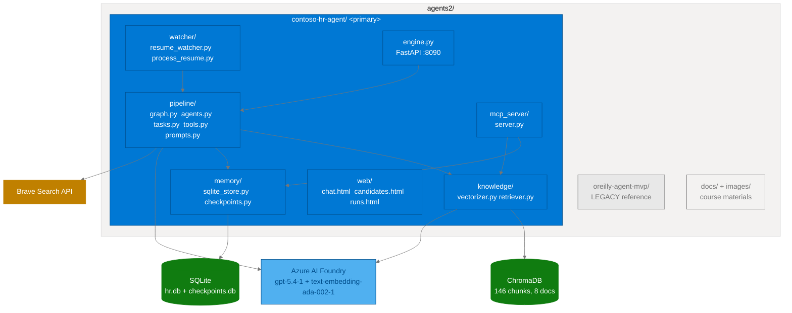

# CLAUDE.md

This file provides guidance to Claude Code (claude.ai/code) when working with code in this repository.

## Repository Layout

The **only active project** is `contoso-hr-agent/`. All active development happens there. The root-level `docs/` and `images/` are course materials only. `oreilly-agent-mvp/` is a **legacy** reference project (issue triage pipeline) and should not be modified unless explicitly requested.

## Working Directory

Most commands below assume you are in `contoso-hr-agent/`. Either `cd` there or prefix paths accordingly.

## Setup

```bash
# All commands run from contoso-hr-agent/ using uv (no manual venv activation needed)

# First-time setup
uv venv && uv sync && uv run hr-seed      # creates venv, installs deps, seeds ChromaDB

# Windows (PowerShell)
.\scripts\setup.ps1

# Linux/macOS
./scripts/setup.sh
```

Copy `.env.example` to `.env` and set your Azure AI Foundry credentials:
`AZURE_AI_FOUNDRY_ENDPOINT`, `AZURE_AI_FOUNDRY_KEY`, `AZURE_AI_FOUNDRY_CHAT_MODEL`, `AZURE_AI_FOUNDRY_EMBEDDING_MODEL`.

## Build / Run Commands

```bash
# One-command lifecycle — kills all 4 project ports first, then starts everything
# and auto-opens TWO browser tabs (chat + MCP Inspector). Press Ctrl+C to stop cleanly.
.\scripts\start.ps1         # Windows: watcher + Inspector + engine, opens chat + Inspector tabs
./scripts/start.sh          # Linux/macOS: same behavior

# Crash-recovery / nuclear stop — safe to run anytime. Kills anything on the
# four project ports (8090, 8091, 5273, 6374), even orphaned processes from
# a crashed start script.
.\scripts\stop.ps1
./scripts/stop.sh

# Bounce: just Ctrl+C in the start window (the finally block clears ports),
# then re-run start. Or stop.ps1 + start.ps1 from another window.

# Individual services (rarely needed)
uv run hr-engine            # FastAPI on port 8090 (kills port first)
uv run hr-watcher           # File watcher for data/incoming/
uv run hr-mcp               # FastMCP 2 SSE on port 8091 (kills port first)
uv run hr-mcp --stdio       # FastMCP 2 stdio transport (for MCP Inspector)
uv run hr-seed              # Re-seed ChromaDB from sample_knowledge/
uv run hr-seed --reset      # Clear ChromaDB and re-seed from scratch

# Acceptance test (one-shot end-to-end pipeline run, ~50s)
uv run python smoke_test.py # Submits Alice Zhang text; asserts Strong Match + score >= 80
                            # Exit codes: 0 pass, 2 fixture missing, 3 pipeline None,
                            #             4 disposition mismatch, 5 score below threshold
```

Engine startup prints four URIs: Web UI (8090), API, Docs, MCP SSE (8091).

**Port map** (chosen to vacate 8080 + 5173 used by another project on this machine):
| Port | Service |
|------|---------|
| 8090 | FastAPI engine (web UI + REST API) |
| 8091 | FastMCP 2 SSE server (only when running `hr-mcp` directly) |
| 5273 | MCP Inspector proxy (env var `SERVER_PORT`) |
| 6374 | MCP Inspector browser UI (env var `CLIENT_PORT`) |

## Test & Lint

```bash
uv run pytest tests/ -v             # All tests
uv run pytest --cov=contoso_hr      # With coverage report

uv run ruff check src/ tests/       # Lint
uv run ruff format src/ tests/      # Format (line length 100)
```

## Architecture

### Stack

LangGraph + CrewAI + FastMCP 2 + Azure AI Foundry (`gpt-5.4-1` chat + `text-embedding-ada-002-1` embedding deployments on `scribe-foundry-resource`) + ChromaDB (146 chunks, 8 docs) + SQLite + Brave Search API

### Repository Overview



### Pipeline Flow (Parallel Fan-Out / Fan-In)

```
Resume file (.txt, .md, .pdf, .docx -- drop or web upload)
    |
LangGraph StateGraph  (pipeline/graph.py, SqliteSaver checkpoints)
  [intake]            -> validate ResumeSubmission
       |--- fan-out ---|
  [policy_expert]      |  CrewAI Crew: PolicyExpertAgent + query_hr_policy (ChromaDB)
  [resume_analyst]     |  CrewAI Crew: ResumeAnalystAgent + brave_web_search (Brave API)
       |--- fan-in ----|
  [decision_maker]    -> CrewAI Crew: DecisionMakerAgent (pure reasoning, no tools)
  [notify]            -> assemble EvaluationResult, log Rich summary
    |
data/outgoing/{candidate_id}_{ts}.json + data/hr.db + data/checkpoints.db
```

**IMPORTANT:** `policy_expert` and `resume_analyst` run **concurrently** (parallel fan-out from `intake`). Both must complete before `decision_maker` begins (fan-in). Parallel nodes must return ONLY the keys they write -- partial state updates are merged by LangGraph.

**Four CrewAI Agents:**
1. **ChatConciergeAgent ("Alex")** -- interactive HR policy Q&A via `/api/chat`, tools: `[query_hr_policy]`
2. **PolicyExpertAgent** -- pipeline node, assesses resume against HR policy, tools: `[query_hr_policy]`
3. **ResumeAnalystAgent** -- pipeline node, scores candidate fit with optional web research, tools: `[brave_web_search]`
4. **DecisionMakerAgent** -- pipeline node, renders final disposition, no tools (pure reasoning)

**Four Dispositions:** Strong Match | Possible Match | Needs Review | Not Qualified

**Chat Memory:** Two-layer pattern -- `localStorage` in browser for instant restore, JSON files in `data/chat_sessions/{session_id}.json` for persistence across browser clears. Past-session context (last 6 turns from last 2 sessions) is injected into each concierge task prompt via `_build_past_session_context()`.

**CrewAI + LangGraph coupling:** Each `*_crew_node` creates a `Crew(agents=[one_agent], tasks=[one_task], process=Process.sequential)` and calls `crew.kickoff()`. LangGraph owns routing/state/persistence; CrewAI owns persona execution.

### Web UI (Three Pages)

All three pages are linked in the navigation bar: **Chat | Candidates | Pipeline Runs**.

| Page | File | Purpose |
|------|------|---------|
| Chat | `web/chat.html` | Chat with "Alex", upload resumes, "New chat" / "Clear history" buttons, Past Sessions sidebar with click-to-restore |
| Candidates | `web/candidates.html` | Evaluation grid + detail modal |
| Pipeline Runs | `web/runs.html` | Pipeline Trace viewer -- split-panel showing full execution per run including parallel branches |

### API Endpoints

| Method | Route | Purpose |
|--------|-------|---------|
| POST | `/api/chat` | Chat with ChatConcierge agent |
| POST | `/api/upload` | Upload resume to `data/incoming/` |
| GET | `/api/candidates` | List all evaluated candidates |
| GET | `/api/candidates/{id}` | Full evaluation for one candidate |
| GET | `/api/stats` | Aggregate evaluation statistics |
| GET | `/api/health` | Health check |
| GET | `/api/chat/history/{id}` | Chat history for a session |
| DELETE | `/api/chat/history/{id}` | Delete chat history for a session |
| GET | `/api/chat/sessions` | List all chat sessions |

### Key Files

| Path | Purpose |
|------|---------|
| `src/contoso_hr/pipeline/graph.py` | LangGraph StateGraph, HRState TypedDict, parallel fan-out/fan-in, all 5 node functions, `create_hr_graph()` |
| `src/contoso_hr/pipeline/agents.py` | ChatConciergeAgent ("Alex"), PolicyExpertAgent, ResumeAnalystAgent, DecisionMakerAgent (CrewAI) |
| `src/contoso_hr/pipeline/tasks.py` | CrewAI Task factories (inject prior state into task descriptions) |
| `src/contoso_hr/pipeline/tools.py` | `@tool query_hr_policy` (ChromaDB) + `@tool brave_web_search` (Brave API) |
| `src/contoso_hr/pipeline/prompts.py` | Agent system prompts |
| `src/contoso_hr/config.py` | Config dataclass, Azure AI Foundry LLM/embeddings factory |
| `src/contoso_hr/models.py` | Full Pydantic v2 model chain: ResumeSubmission -> PolicyContext -> CandidateEval -> HRDecision -> EvaluationResult |
| `src/contoso_hr/knowledge/vectorizer.py` | Ingest policy docs (.txt/.md/.pdf/.doc/.pptx) -> Azure embeddings -> ChromaDB |
| `src/contoso_hr/knowledge/retriever.py` | `query_policy_knowledge(question, k)` -> PolicyContext |
| `src/contoso_hr/memory/sqlite_store.py` | HRSQLiteStore: candidates + evaluations tables |
| `src/contoso_hr/memory/checkpoints.py` | `get_checkpointer()`, `make_thread_config(session_id)` |
| `src/contoso_hr/engine.py` | FastAPI: all API endpoints, `_build_past_session_context()`, startup URI prints |
| `src/contoso_hr/watcher/resume_watcher.py` | Polls data/incoming/ for .txt/.md files |
| `src/contoso_hr/mcp_server/server.py` | FastMCP 2 server -- all 5 MCP primitives (SSE :8091 or stdio) |
| `src/contoso_hr/util/port_utils.py` | `force_kill_port(port)` -- called on every startup |

### Data Model Chain

```
ResumeSubmission (input)
  -> PolicyContext     (ChromaDB retrieval result)
  -> CandidateEval     (skills_match_score, experience_score, strengths, red_flags)
  -> HRDecision        (decision: Strong Match|Possible Match|Needs Review|Not Qualified, reasoning, next_steps, overall_score)
  -> EvaluationResult  (final -- written to SQLite + served by API)
```

### LLM Configuration (Azure AI Foundry)

All LLM calls use `AzureChatOpenAI` (from `langchain-openai`). CrewAI uses `LLM(model="azure/{deployment}", ...)` via LiteLLM. Embeddings use `AzureOpenAIEmbeddings`. All three share the same endpoint/key from `.env`.

Required env vars: `AZURE_AI_FOUNDRY_ENDPOINT`, `AZURE_AI_FOUNDRY_KEY`, `AZURE_AI_FOUNDRY_CHAT_MODEL`, `AZURE_AI_FOUNDRY_EMBEDDING_MODEL`.

### Port Management

`force_kill_port(port)` in `util/port_utils.py` is called at the top of `engine.py:main()` and `mcp_server/__main__.py:main()` (SSE branch only — see stdio gotcha below). Scripts also kill ports as belt-and-suspenders. Always uses port 8090 (engine) and 8091 (MCP SSE).

### MCP stdio mode — DO NOT write to stdout

`mcp_server/__main__.py` has two branches:
- **SSE mode** (`uv run hr-mcp`): calls `setup_logging()` + `force_kill_port(8091)` + Rich console banner. All fine — uses stdout freely.
- **stdio mode** (`uv run hr-mcp --stdio`, used by MCP Inspector): JSON-RPC owns stdout. ANY non-JSON byte on stdout (Rich logs, `print()`, banners) corrupts the protocol and the Inspector throws `SyntaxError: Unexpected number in JSON at position 2`. The stdio branch routes **all logging to stderr** via a separate `Console(stderr=True)`. If you add new logging or `print()` calls anywhere in the import chain reachable from stdio mode, ensure they go to stderr.

### MCP Server (FastMCP 2)

Supports SSE transport (`http://localhost:8091/sse`) and stdio (`uv run hr-mcp --stdio`). Implements all five MCP primitives:

**Tools:** `get_candidate`, `list_candidates`, `trigger_resume_evaluation`, `query_policy`, `generate_eval_summary` (sampling -- asks the connected LLM to write an executive summary), `confirm_and_evaluate` (elicitation -- prompts the user to confirm before running the pipeline).

**Static Resources:** `schema://candidate`, `stats://evaluations`, `samples://resumes`, `config://settings`.

**Resource Templates:** `candidate://{candidate_id}` (formatted markdown profile), `policy://{topic}` (semantic search over ChromaDB).

**Prompts:** `evaluate_resume` (multi-message trainer eval), `policy_query` (structured policy Q&A), `disposition_review` (fetch candidate + format for hiring-committee review).

**Sampling (Primitive 4):** Used by `generate_eval_summary` -- the server sends candidate data to the connected LLM via `ctx.sample()` and returns a concise briefing.

**Elicitation (Primitive 5):** Used by `confirm_and_evaluate` -- `ctx.elicit()` pauses the tool, presents a confirmation form to the user, and resumes only on accept.

## Code Conventions

- Python 3.11+, `snake_case`, 4-space indent, 100-char line limit
- Ruff for lint/format: `uv run ruff check src/ tests/`
- Pydantic v2 for all data models (`model_dump()`, `model_dump_json()`, `model_validate_json()`)
- One `Crew.kickoff()` per LangGraph node -- no nested orchestration
- Parallel nodes return only the state keys they own (partial updates merged by LangGraph)
- Tests use `tmp_path` fixtures; no live API calls in unit tests
- `data/` directories are runtime-only -- never commit their contents

## CLI Scripts (pyproject.toml)

```
hr-engine     ->  contoso_hr.engine:main
hr-watcher    ->  contoso_hr.watcher.resume_watcher:main
hr-mcp        ->  contoso_hr.mcp_server:main
hr-seed       ->  contoso_hr.knowledge.vectorizer:main
```

## Legacy Reference

`oreilly-agent-mvp/` contains an earlier demo (GitHub issue triage with PM/Dev/QA agents). It is retained for reference but is **not** the active project. Do not modify it unless explicitly asked.
