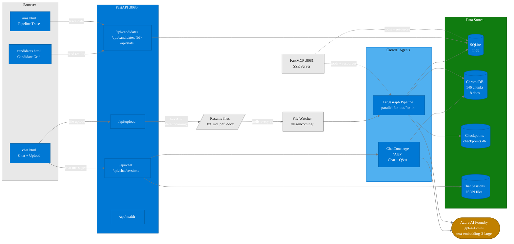
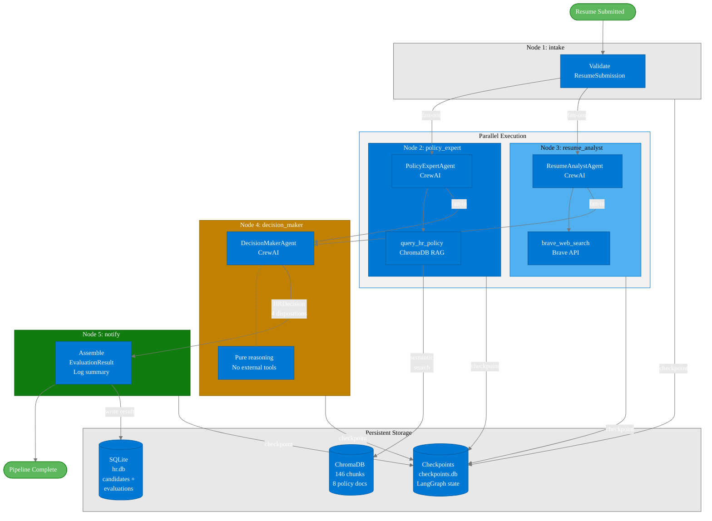

# Contoso HR Agent -- O'Reilly AI Agents Course

<p align="center">
   
</p>

**O'Reilly Live Learning Course** | 4 Hours | LangGraph - CrewAI - MCP - Azure AI Foundry

[](https://techtrainertim.com)
[](https://www.linkedin.com/in/timothywarner/)
[](https://github.com/timothywarner-org)
[](https://learning.oreilly.com/search/?query=Tim%20Warner)

**Contact:** [Website](https://techtrainertim.com) | [LinkedIn](https://www.linkedin.com/in/timothywarner/) | [GitHub](https://github.com/timothywarner-org) | [O'Reilly](https://learning.oreilly.com/search/?query=Tim%20Warner)

---

## What It Demonstrates

The **Contoso HR Agent** is an automated resume screening and HR policy Q&A system that screens candidates for a Microsoft Certified Trainer (MCT) position. It showcases five pillars of production-ready AI agent design:

| Pillar | What It Shows | Where to Look |
|--------|---------------|---------------|
| **Interactive Chat** | Web chat UI backed by a CrewAI ChatConcierge agent grounded in ChromaDB policy retrieval; past-session context (last 6 turns from last 2 sessions) injected into each prompt | `web/chat.html`, `engine.py /api/chat` |
| **Event-Driven Autonomy** | File watcher polls `data/incoming/` -- drop a resume and the full pipeline runs automatically | `watcher/resume_watcher.py` |
| **Memory and State** | LangGraph `SqliteSaver` checkpoints + SQLite candidate store + server-side chat session JSON | `memory/`, `data/hr.db`, `data/checkpoints.db` |
| **Parallel LLM Reasoning** | LangGraph StateGraph fan-out/fan-in: `policy_expert` and `resume_analyst` run **concurrently**, then fan-in to `decision_maker` | `pipeline/graph.py`, `pipeline/agents.py` |
| **MCP Tool Calling** | FastMCP 2 SSE server exposes tools, resources, and prompts to external AI clients | `mcp_server/server.py` (port 8081) |

---

## System Architecture



---

## Quick Start

### Prerequisites

- Python 3.11+
- [uv](https://docs.astral.sh/uv/) package manager
- Azure AI Foundry account with deployed `gpt-4-1-mini` and `text-embedding-3-large` models
- Optional: [Brave Search API key](https://api.search.brave.com/register) (free tier, 2000 queries/month)
- Optional: Node.js (for MCP Inspector)

### Setup

```bash
# 1. Clone and enter the project
git clone https://github.com/timothywarner-org/agents2.git
cd agents2/contoso-hr-agent

# 2. Create venv, install dependencies, seed ChromaDB
uv venv && uv sync && uv run hr-seed

# 3. Configure credentials
cp .env.example .env
# Edit .env and set:
#   AZURE_AI_FOUNDRY_ENDPOINT=https://your-account.cognitiveservices.azure.com/
#   AZURE_AI_FOUNDRY_KEY=your-key
#   AZURE_AI_FOUNDRY_CHAT_MODEL=gpt-4-1-mini
#   AZURE_AI_FOUNDRY_EMBEDDING_MODEL=text-embedding-3-large

# 4. Start everything (FastAPI + file watcher)
./scripts/start.sh          # Linux / macOS
.\scripts\start.ps1         # Windows PowerShell

# 5. Open the UI
#    Chat:           http://localhost:8080/chat.html
#    Candidates:     http://localhost:8080/candidates.html
#    Pipeline Runs:  http://localhost:8080/runs.html
```

### Individual Services

```bash
uv run hr-engine            # FastAPI only (port 8080)
uv run hr-watcher           # File watcher only
uv run hr-mcp               # FastMCP 2 server (port 8081)
uv run hr-seed --reset      # Clear and re-seed ChromaDB
```

---

## LangGraph Pipeline Flow (Parallel Fan-Out / Fan-In)

The pipeline runs once per resume. LangGraph owns **when** and **state**. CrewAI owns **who** and **what**. Each node wraps exactly one `Crew.kickoff()` call.

**Key teaching point:** After `intake`, the `policy_expert` and `resume_analyst` nodes run **concurrently** (parallel fan-out). Both must complete before `decision_maker` begins (fan-in). This pattern demonstrates how LangGraph supports parallel branches for independent work, reducing total pipeline latency.



### Data Model Chain

Each node produces a Pydantic v2 model that feeds the next:

```
ResumeSubmission  (input: candidate name, resume text, file path)
  -> PolicyContext     (ChromaDB retrieval: relevant policy chunks + sources)
  -> CandidateEval     (skills_match_score, experience_score, strengths, red_flags)
  -> HRDecision        (disposition + reasoning + next_steps + overall_score)
  -> EvaluationResult  (final composite written to SQLite + served by API)
```

### Four Dispositions

| Disposition | Meaning |
|-------------|---------|
| **Strong Match** | Candidate exceeds MCT requirements; recommend immediate interview |
| **Possible Match** | Candidate meets most requirements; some gaps to discuss |
| **Needs Review** | Candidate has potential but significant gaps; needs committee review |
| **Not Qualified** | Candidate does not meet minimum requirements for the MCT role |

---

## Web UI (Three Pages)

All three pages are linked in the navigation bar: **Chat | Candidates | Pipeline Runs**.

| Page | URL | Purpose |
|------|-----|---------|
| **Chat** | `/chat.html` | Chat with the ChatConcierge agent ("Alex"), upload resumes, "New chat" and "Clear history" buttons, Past Sessions panel in right sidebar with click-to-restore |
| **Candidates** | `/candidates.html` | Evaluation grid with detail modal for each candidate |
| **Pipeline Runs** | `/runs.html` | Pipeline Trace viewer -- split-panel view showing full pipeline execution per run, including the parallel `policy_expert` and `resume_analyst` branches |

---

## API Endpoints

| Method | Route | Purpose |
|--------|-------|---------|
| POST | `/api/chat` | Send a chat message to the ChatConcierge agent |
| POST | `/api/upload` | Upload a resume file to `data/incoming/` |
| GET | `/api/candidates` | List all evaluated candidates |
| GET | `/api/candidates/{id}` | Get full evaluation for one candidate |
| GET | `/api/stats` | Aggregate evaluation statistics |
| GET | `/api/health` | Health check |
| GET | `/api/chat/history/{id}` | Retrieve chat history for a session |
| DELETE | `/api/chat/history/{id}` | Delete chat history for a session |
| GET | `/api/chat/sessions` | List all chat sessions |

---

## Demo Walkthrough

Follow these five steps to see every pillar in action:

### Step 1 -- Chat with the Concierge

Open `http://localhost:8080/chat.html` and ask a policy question:

> "What are the minimum qualifications for the MCT trainer position?"

The ChatConcierge agent retrieves policy chunks from ChromaDB and responds with grounded answers -- no hallucination. Use the Past Sessions sidebar to restore earlier conversations.

### Step 2 -- Upload a Resume

Use the upload button in `chat.html` to submit one of the sample resumes (e.g., `RESUME_Sarah_Chen_AZ-104_Trainer-v3.txt`). The file lands in `data/incoming/`.

### Step 3 -- Watch the Pipeline Run

The file watcher detects the new resume within 3 seconds and triggers the full LangGraph pipeline. Watch the terminal for Rich-formatted logs as each agent runs:

1. **intake** validates the submission
2. **policy_expert** and **resume_analyst** run **in parallel** (fan-out)
   - policy_expert retrieves relevant HR policies from ChromaDB
   - resume_analyst scores the candidate (optionally searches the web via Brave)
3. **decision_maker** renders a disposition with reasoning (fan-in)
4. **notify** assembles the final result and writes to SQLite

### Step 4 -- Review Results and Traces

Open `http://localhost:8080/candidates.html` to see the evaluation grid. Click any candidate for the full detail modal. Open `http://localhost:8080/runs.html` to inspect the pipeline trace for each run, including the parallel branches.

### Step 5 -- Explore MCP

Start the MCP server with `uv run hr-mcp` and use [MCP Inspector](https://github.com/modelcontextprotocol/inspector) to call tools like `list_candidates`, `query_policy`, and `trigger_resume_evaluation`. This shows how external AI clients can interact with the pipeline programmatically.

---

## Engine Startup Output

When the engine starts, it prints four URIs:

```
  Web UI:  http://localhost:8080/chat.html
  API:     http://localhost:8080/api/
  Docs:    http://localhost:8080/docs
  MCP SSE: http://localhost:8081/sse
```

Ports 8080 (engine) and 8081 (MCP) are force-killed on every startup to avoid "address already in use" errors.

---

## Project Structure

```
agents2/
├── README.md                          # This file (course-level overview)
├── CLAUDE.md                          # Claude Code guidance for this repo
├── AGENTS.md                          # Repository guidelines for AI agents
├── contoso-hr-agent/                  # Primary demo project
│   ├── src/contoso_hr/
│   │   ├── pipeline/
│   │   │   ├── graph.py               # LangGraph StateGraph, parallel fan-out/fan-in,
│   │   │   │                          #   HRState, 5 node functions, create_hr_graph()
│   │   │   ├── agents.py             # 4 CrewAI agents (ChatConcierge, PolicyExpert,
│   │   │   │                          #   ResumeAnalyst, DecisionMaker)
│   │   │   ├── tasks.py              # CrewAI Task factories
│   │   │   ├── prompts.py            # System prompts for all 4 agents
│   │   │   └── tools.py              # query_hr_policy (ChromaDB), brave_web_search
│   │   ├── knowledge/
│   │   │   ├── vectorizer.py          # Ingest policy docs -> Azure embeddings -> ChromaDB
│   │   │   └── retriever.py           # query_policy_knowledge() -> PolicyContext
│   │   ├── memory/
│   │   │   ├── sqlite_store.py        # candidates + evaluations tables
│   │   │   └── checkpoints.py         # LangGraph SqliteSaver wrapper
│   │   ├── mcp_server/
│   │   │   └── server.py              # FastMCP 2 SSE server (port 8081)
│   │   ├── watcher/
│   │   │   └── resume_watcher.py      # Polls data/incoming/ every 3 seconds
│   │   ├── util/
│   │   │   └── port_utils.py          # force_kill_port() for clean startup
│   │   ├── engine.py                  # FastAPI server (port 8080), web UI + REST API
│   │   ├── config.py                  # Azure AI Foundry config, LLM/embedding factories
│   │   ├── models.py                  # Pydantic v2 data contracts (full model chain)
│   │   └── logging_setup.py           # Rich-formatted structured logging
│   ├── web/
│   │   ├── chat.html                  # Chat UI + resume upload + Past Sessions sidebar
│   │   ├── chat.js                    # Chat client logic + localStorage
│   │   ├── candidates.html            # Evaluation grid + detail modal
│   │   ├── candidates.js              # Candidate grid client logic
│   │   ├── runs.html                  # Pipeline Trace viewer (split-panel, parallel branches)
│   │   ├── runs.js                    # Pipeline trace client logic
│   │   └── style.css                  # Shared styles
│   ├── sample_resumes/                # 13 trainer candidate resumes (3 quality tiers)
│   ├── sample_knowledge/              # 8 HR policy documents (PDF, DOCX, PPTX, MD)
│   ├── data/                          # Runtime data (gitignored)
│   │   ├── incoming/                  # Resume drop folder (watcher polls here)
│   │   ├── processed/                 # Resumes after pipeline completes
│   │   ├── outgoing/                  # JSON evaluation results
│   │   ├── chroma/                    # ChromaDB vector store (146 chunks, 8 docs)
│   │   ├── chat_sessions/             # Server-side chat history JSON
│   │   ├── hr.db                      # SQLite candidate + evaluation store
│   │   └── checkpoints.db             # LangGraph state checkpoints
│   ├── scripts/                       # Setup and launch scripts (sh + ps1)
│   ├── tests/                         # pytest test suite
│   ├── pyproject.toml                 # uv project config + CLI entry points
│   ├── .env.example                   # Environment variable template
│   └── .mcp.json                      # MCP client configuration
├── oreilly-agent-mvp/                 # LEGACY reference (issue triage pipeline) -- not active
├── copilot-studio/                    # Copilot Studio demo assets
├── claude-agent/                      # Claude Code agent configuration
├── docs/                              # Course materials and supporting assets
└── images/                            # Course images
```

---

## Sample Resume Corpus

The 13 sample resumes in `contoso-hr-agent/sample_resumes/` span three quality tiers to exercise every disposition path:

| Tier | Expected Disposition | Resumes | Why |
|------|---------------------|---------|-----|
| **Strong** | Strong Match | Sarah Chen (AZ-104), Alice Zhang (Azure), Rachel Torres (DevOps), David Park (M365 Security), James Okafor (Security), Tomoko Sato (Educator) | Active MCT, deep cert stacks, 4.5+ learner ratings, curriculum authorship |
| **Mid** | Possible Match / Needs Review | Bob Martinez (M365), Carol Okonkwo (Data), Priya Kapoor (AI Engineer), Marcus Johnson (Cloud Engineer) | Some certs but gaps in training delivery, MCT status, or specialization |
| **Weak** | Not Qualified | David Kim (Finance PM), Kevin Walsh (Marketing), Alex Rivera (Tech Professional) | No MCT, no relevant certs, no training delivery experience |

---

## Azure AI Foundry Deployment

The Contoso HR Agent connects to Azure AI Foundry for all LLM and embedding calls. The reference deployment uses:

| Resource | Value |
|----------|-------|
| **Resource name** | `contoso-hr-ai` |
| **Resource group** | `contoso-hr-rg` |
| **Region** | East US 2 |
| **Chat model** | `gpt-4-1-mini` |
| **Embedding model** | `text-embedding-3-large` |
| **API version** | `2024-05-01-preview` |

### Required Environment Variables

```bash
AZURE_AI_FOUNDRY_ENDPOINT=https://contoso-hr-ai.cognitiveservices.azure.com/
AZURE_AI_FOUNDRY_KEY=your-api-key
AZURE_AI_FOUNDRY_CHAT_MODEL=gpt-4-1-mini
AZURE_AI_FOUNDRY_EMBEDDING_MODEL=text-embedding-3-large
```

### Finding Your Credentials

```bash
# Via Azure CLI
az cognitiveservices account show \
  --name contoso-hr-ai -g contoso-hr-rg \
  --query properties.endpoint -o tsv

az cognitiveservices account keys list \
  --name contoso-hr-ai -g contoso-hr-rg \
  --query key1 -o tsv
```

### Teardown

```bash
# Delete everything when done
az group delete --name contoso-hr-rg --yes --no-wait
```

---

## Legacy Reference

The `oreilly-agent-mvp/` directory contains an earlier iteration of the course demo -- a GitHub issue triage pipeline with PM/Dev/QA agents. It is retained as reference material only and is **not** the active project. All learner-facing work uses `contoso-hr-agent/`.

---

## Troubleshooting

| Problem | Solution |
|---------|----------|
| `uv sync` fails | Verify Python 3.11+ is installed (`python --version`). Install uv: `pip install uv` or see [uv docs](https://docs.astral.sh/uv/). |
| Azure key not working | Check `.env` for typos. Endpoint must end with `/`. Verify deployment names match. |
| Port already in use | Start scripts auto-kill ports 8080/8081. If stuck, manually kill the process. |
| ChromaDB empty | Run `uv run hr-seed --reset` to clear and re-seed from `sample_knowledge/`. |
| No web search results | Set `BRAVE_API_KEY` in `.env`. The agent gracefully skips web search if unset. |

See [contoso-hr-agent/README.md](contoso-hr-agent/README.md) for the full troubleshooting guide.

---

## Resources

- [Contoso HR Agent docs](contoso-hr-agent/README.md) -- full project README with detailed architecture
- [LangGraph Documentation](https://langchain-ai.github.io/langgraph/)
- [CrewAI Documentation](https://docs.crewai.com/)
- [Azure AI Foundry Documentation](https://learn.microsoft.com/en-us/azure/ai-studio/)
- [FastMCP Documentation](https://github.com/jlowin/fastmcp)
- [Model Context Protocol Specification](https://modelcontextprotocol.io/)

---

## License and Usage

MIT License -- feel free to use this code in your own projects.

**Course Materials:** (c) 2026 Tim Warner / O'Reilly Media
**Code:** Open source, use freely

---

## About the Instructor

**Tim Warner** teaches cloud, DevOps, and AI at O'Reilly, Pluralsight, and LinkedIn Learning.

- [TechTrainerTim.com](https://TechTrainerTim.com)
- [LinkedIn](https://linkedin.com/in/timothywarner)
- [GitHub](https://github.com/timothywarner-org)
