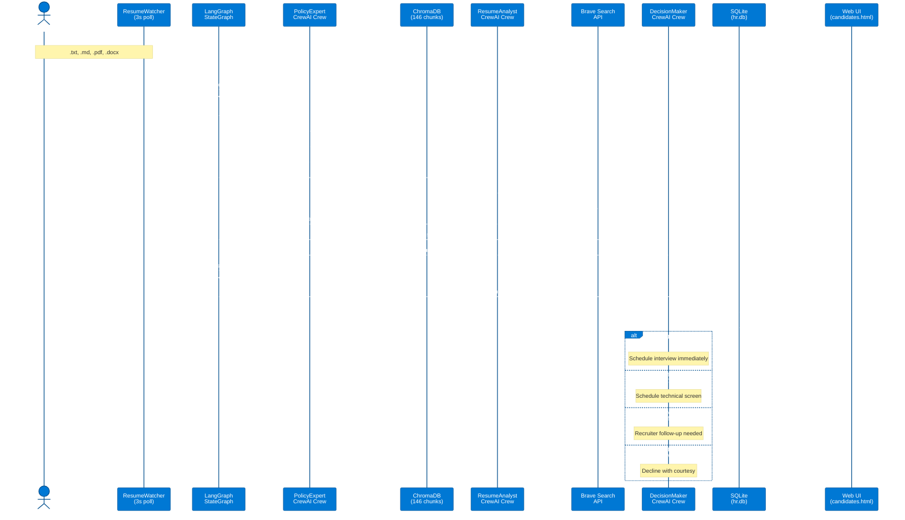
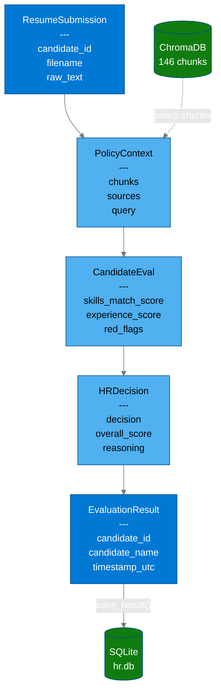
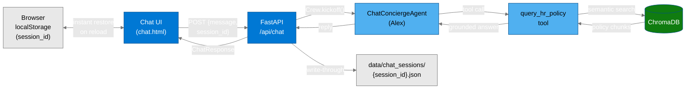

# Contoso HR Agent

An O'Reilly training demo showing production AI agent patterns through a realistic HR use case: automated resume screening for the open Microsoft Certified Trainer (MCT) position and HR policy Q&A.

## What It Demonstrates

| Pillar | Implementation |
|--------|----------------|
| **(a) Interactive chat** | Web chat UI + FastAPI `/api/chat` backed by ChatConciergeAgent ("Alex") with ChromaDB-grounded policy retrieval |
| **(b) Event-driven autonomy** | `ResumeWatcher` polls `data/incoming/` every 3 s -- drop a resume, the 3-agent pipeline runs automatically |
| **(c) Memory and state** | LangGraph `SqliteSaver` checkpoints + SQLite candidate store + two-layer chat history (localStorage + server JSON) |
| **(d) Multi-agent reasoning** | LangGraph StateGraph orchestrates 3 CrewAI agents (PolicyExpert, ResumeAnalyst, DecisionMaker) with one `Crew.kickoff()` per node |
| **(e) Tool use and MCP** | FastMCP 2 server (SSE, port 8081) + `query_hr_policy` tool (ChromaDB) + `brave_web_search` tool (Brave API) |

## Quick Start

### Prerequisites

- Python 3.11+
- [uv](https://docs.astral.sh/uv/) package manager
- Azure AI Foundry account with deployed chat + embedding models
- Node.js (optional, for MCP Inspector)

### Setup

```bash
# Windows
.\scripts\setup.ps1

# Linux/macOS
./scripts/setup.sh
```

Copy `.env.example` to `.env` and fill in your credentials:

```bash
AZURE_AI_FOUNDRY_ENDPOINT=https://contoso-hr-ai.cognitiveservices.azure.com/
AZURE_AI_FOUNDRY_KEY=your-api-key
AZURE_AI_FOUNDRY_CHAT_MODEL=gpt-4-1-mini
AZURE_AI_FOUNDRY_EMBEDDING_MODEL=text-embedding-3-large
AZURE_AI_FOUNDRY_API_VERSION=2024-05-01-preview
BRAVE_API_KEY=your-brave-search-api-key       # optional
```

Seed the knowledge base:

```bash
uv run hr-seed --reset   # clears ChromaDB and re-ingests all policy docs (8 docs, 146 chunks)
```

### Start

```bash
# Windows
.\scripts\start.ps1

# Linux/macOS
./scripts/start.sh
```

Open **http://localhost:8080/chat.html** in your browser.

## Agent Roster

```mermaid
%%{init: {'theme':'base','themeVariables':{'primaryColor':'#0078D4','primaryTextColor':'#FFFFFF','primaryBorderColor':'#004E8C','lineColor':'#767676','secondaryColor':'#E8E8E8','tertiaryColor':'#F3F2F1'}}}%%
flowchart LR
    subgraph concierge ["Chat Concierge (Alex)"]
        direction TB
        C_ROLE["Role: HR Chat Concierge"]
        C_TOOL["Tool: query_hr_policy"]
        C_WHEN["When: /api/chat request"]
        C_NOTE["verbose=False"]
    end

    subgraph policy ["Policy Expert"]
        direction TB
        P_ROLE["Role: HR Policy Expert"]
        P_TOOL["Tool: query_hr_policy"]
        P_WHEN["When: pipeline node 2"]
    end

    subgraph analyst ["Resume Analyst"]
        direction TB
        A_ROLE["Role: Sr. Talent Acquisition"]
        A_TOOL["Tool: brave_web_search"]
        A_WHEN["When: pipeline node 3"]
    end

    subgraph decision ["Decision Maker"]
        direction TB
        D_ROLE["Role: Hiring Committee Chair"]
        D_TOOL["Tools: none (pure reasoning)"]
        D_WHEN["When: pipeline node 4"]
    end

    concierge --- policy --- analyst --- decision

    style concierge fill:#0078D4,stroke:#004E8C,color:#FFFFFF
    style policy fill:#107C10,stroke:#004E8C,color:#FFFFFF
    style analyst fill:#107C10,stroke:#004E8C,color:#FFFFFF
    style decision fill:#107C10,stroke:#004E8C,color:#FFFFFF
```



- **ChatConciergeAgent ("Alex")** -- Handles interactive chat Q&A via `/api/chat`. Uses `query_hr_policy` to ground every policy answer in ChromaDB. Set to `verbose=False` so crew output does not leak into chat responses.
- **PolicyExpertAgent** -- Pipeline node 2. Retrieves Contoso HR policies from ChromaDB and assesses candidate compliance, recommended level (L1--L5), and compensation band.
- **ResumeAnalystAgent** -- Pipeline node 3. Scores candidate fit (skills 0--100, experience 0--100) using resume analysis and optional Brave web search for credential verification.
- **DecisionMakerAgent** -- Pipeline node 4. Pure reasoning over prior agent outputs. Renders one of four dispositions with an overall score and concrete next steps.

## Evaluation Pipeline



## Demo Walkthrough

### 1. Chat with the HR Assistant

Open `http://localhost:8080/chat.html` and ask policy questions:

- "What is Contoso's EEO policy?"
- "What is the salary band for a Level 3 trainer?"
- "How does the interview process work?"

Alex retrieves answers from the ChromaDB knowledge base (8 docs, 146 chunks) using the `query_hr_policy` tool.

### 2. Upload a Resume

Click the upload area in the chat UI and upload any resume from `sample_resumes/` (for example, `RESUME_Sarah_Chen_AZ-104_Trainer-v3.txt`). The pipeline runs automatically:

1. **intake** -- validates the ResumeSubmission
2. **policy_expert** -- ChromaDB policy lookup and compliance assessment
3. **resume_analyst** -- scores skills and experience, optional Brave web search
4. **decision_maker** -- renders disposition (Strong Match / Possible Match / Needs Review / Not Qualified)
5. **notify** -- assembles EvaluationResult, writes to SQLite

Alternatively, drop any `.txt`, `.md`, `.pdf`, or `.docx` file directly into `data/incoming/` while the watcher is running.

### 3. View Candidate Results

Open `http://localhost:8080/candidates.html` -- auto-refreshes every 10 seconds. Click any card for the full evaluation detail including scores, strengths, red flags, reasoning, and next steps.

### 4. Observe Memory and Persistence

Each pipeline run uses a stable `thread_id` with LangGraph `SqliteSaver`. Run the same resume twice and the second run finds prior checkpoint state in `data/checkpoints.db`.

Chat history uses two-layer persistence (see Diagram D below). Pipeline results persist in `data/hr.db`.

### 5. Explore the MCP Server

```bash
.\scripts\start_mcp.ps1   # Windows
./scripts/start_mcp.sh    # Linux/macOS
```

MCP Inspector opens automatically. Try:

- `list_candidates` -- see all evaluations
- `query_policy` with "What is the hiring process?"
- `trigger_resume_evaluation` with resume text from a sample file

## Data Model Chain



All models are Pydantic v2 BaseModel classes defined in `src/contoso_hr/models.py`. The pipeline passes serialized dicts (`model_dump()`) through LangGraph state for checkpoint compatibility.

## Chat Memory Architecture



Two-layer persistence keeps chat responsive and durable:

- **Client-side:** `localStorage` keyed by `session_id` -- instant restore on page reload, no server round-trip.
- **Server-side:** JSON files in `data/chat_sessions/{session_id}.json` -- survives browser clears, accessible via API.

| Endpoint | Method | Purpose |
|----------|--------|---------|
| `/api/chat/history/{session_id}` | GET | Retrieve persisted chat history for a session |
| `/api/chat/history/{session_id}` | DELETE | Clear persisted chat history for a session |

## Project Structure

```
contoso-hr-agent/
├── src/contoso_hr/
│   ├── pipeline/              # LangGraph + CrewAI pipeline
│   │   ├── graph.py           # StateGraph: 5 nodes (intake, policy_expert,
│   │   │                      #   resume_analyst, decision_maker, notify)
│   │   ├── agents.py          # ChatConciergeAgent, PolicyExpertAgent,
│   │   │                      #   ResumeAnalystAgent, DecisionMakerAgent
│   │   ├── tasks.py           # CrewAI Task factories (inject state into prompts)
│   │   ├── tools.py           # @tool: query_hr_policy, brave_web_search
│   │   └── prompts.py         # Agent system prompts (persona + output format)
│   ├── knowledge/             # ChromaDB vectorization + retrieval
│   │   ├── vectorizer.py      # Ingest policy docs -> embeddings -> ChromaDB
│   │   └── retriever.py       # query_policy_knowledge(question, k) -> PolicyContext
│   ├── watcher/               # File watcher for data/incoming/
│   │   ├── resume_watcher.py  # ResumeWatcher: polls every 3s
│   │   └── process_resume.py  # Runs LangGraph pipeline + saves result
│   ├── memory/                # Persistence layer
│   │   ├── sqlite_store.py    # HRSQLiteStore: candidates + evaluations tables
│   │   └── checkpoints.py     # LangGraph SqliteSaver wrapper
│   ├── mcp_server/            # FastMCP 2 (SSE, port 8081)
│   │   ├── server.py          # Tools, resources, and prompts
│   │   └── __main__.py        # Entry point (kills port on startup)
│   ├── util/                  # Utilities
│   │   ├── port_utils.py      # force_kill_port(port)
│   │   ├── fs.py              # ensure_dirs()
│   │   └── token_tracking.py  # Token usage tracking
│   ├── engine.py              # FastAPI app (port 8080, serves web/ static files)
│   ├── config.py              # Config dataclass, Azure AI Foundry LLM/embeddings
│   ├── models.py              # Pydantic v2 data contracts (full model chain)
│   └── logging_setup.py       # Rich-based structured logging
├── web/                       # HTML/JS/CSS frontend
│   ├── chat.html / chat.js    # Chat UI with upload widget
│   ├── candidates.html / .js  # Candidate results grid (auto-refresh)
│   └── style.css              # Shared styles
├── data/                      # Runtime data (gitignored)
│   ├── incoming/              # Resume drop folder (watched)
│   ├── processed/             # Archived after evaluation
│   ├── outgoing/              # Result JSON files
│   ├── chroma/                # ChromaDB vector store
│   ├── chat_sessions/         # Server-side chat history
│   ├── hr.db                  # SQLite candidate store
│   └── checkpoints.db         # LangGraph SqliteSaver
├── sample_resumes/            # 13 trainer candidate resumes (RESUME_*.txt)
├── sample_knowledge/          # HR policy docs (.md, .pdf, .docx, .pptx)
├── scripts/                   # Setup and launch scripts
│   ├── setup.ps1 / setup.sh
│   ├── start.ps1 / start.sh
│   └── start_mcp.ps1 / .sh
├── tests/                     # Pytest test suite
└── pyproject.toml             # Project config (uv, ruff, scripts)
```

## API Reference

| Endpoint | Method | Purpose |
|----------|--------|---------|
| `/api/chat` | POST | Send a chat message to Alex (ChatConciergeAgent). Body: `{message, session_id}`. Returns `{reply, session_id, suggestions}`. |
| `/api/upload` | POST | Upload a resume file (`.txt`, `.md`, `.pdf`, `.docx`). Saved to `data/incoming/` for watcher pickup. Returns `{candidate_id, filename, status, message}`. |
| `/api/candidates` | GET | List evaluated candidates. Query params: `limit` (default 50), `decision` (filter). Returns `CandidateSummary[]`. |
| `/api/candidates/{id}` | GET | Full `EvaluationResult` for one candidate. 404 if not found. |
| `/api/stats` | GET | Aggregate statistics: total evaluations, decision breakdown, average score, average duration. |
| `/api/chat/history/{session_id}` | GET | Retrieve persisted chat history for a session. |
| `/api/chat/history/{session_id}` | DELETE | Clear persisted chat history for a session. |
| `/api/health` | GET | Health check. Returns `{status: "ok"}`. |

## Sample Resume Corpus

The 13 `RESUME_*.txt` files in `sample_resumes/` cover three quality tiers for MCT trainer screening:

| Tier | Candidates | Description |
|------|-----------|-------------|
| **Excellent** | Sarah Chen, Alice Zhang, Rachel Torres, Tomoko Sato | Active MCT, multiple Azure/M365/Security certs, strong training metrics (100+ sessions, 4.7+ ratings) |
| **Mid-tier** | Bob Martinez, David Park, James Okafor, Carol Okonkwo, Priya Kapoor | Some relevant certs or experience, but gaps in training delivery or credentials |
| **Poor match** | David Kim, Kevin Walsh, Marcus Johnson, Alex Rivera | No MCT, no training experience, or entirely different career focus |

## Azure AI Foundry Deployment

| Setting | Value |
|---------|-------|
| Resource group | `contoso-hr-rg` |
| Resource name | `contoso-hr-ai` |
| Endpoint | `https://contoso-hr-ai.cognitiveservices.azure.com/` |
| Region | `eastus2` |
| Chat model | `gpt-4-1-mini` |
| Embedding model | `text-embedding-3-large` |
| API version | `2024-05-01-preview` |

Teardown when finished:

```bash
az group delete --name contoso-hr-rg --yes --no-wait
```

## MCP Server (FastMCP 2, SSE)

Port 8081. Connect via MCP Inspector at `http://localhost:5173` with SSE URL `http://localhost:8081/sse`.

### Tools

| Tool | Parameters | Purpose |
|------|-----------|---------|
| `get_candidate` | `candidate_id` | Full EvaluationResult for one candidate |
| `list_candidates` | `limit`, `decision_filter` | Recent evaluations (filterable by disposition) |
| `trigger_resume_evaluation` | `resume_text`, `filename` | Run the full pipeline directly (bypasses watcher) |
| `query_policy` | `question` | ChromaDB semantic search over HR policy docs |

### Resources

| URI | Content |
|-----|---------|
| `schema://candidate` | EvaluationResult JSON schema |
| `stats://evaluations` | Aggregate evaluation statistics |
| `samples://resumes` | List of available sample resume files |
| `config://settings` | Current application configuration (no secrets) |

### Prompts

| Prompt | Parameters | Purpose |
|--------|-----------|---------|
| `evaluate_resume` | `resume_text`, `role` (optional) | Structured trainer resume evaluation prompt |
| `policy_query` | `question` | Structured HR policy query prompt |

## Remote MCP Servers (.mcp.json)

- **Azure MCP** (`@azure/mcp`) -- inspect/provision Azure AI Foundry resources
- **Brave Search MCP** (`@modelcontextprotocol/server-brave-search`) -- web search (also used directly in ResumeAnalystAgent)

## Extension Ideas

- Email notifications via Microsoft Graph API when a candidate is evaluated
- Add a 5th agent: InterviewScheduler that proposes calendar slots
- Connect Azure MCP to provision Foundry resources automatically in the demo
- Upgrade ChromaDB to Azure AI Search for enterprise-scale vector retrieval
- Add token usage tracking and cost dashboards to the web UI
- Implement webhook notifications for real-time pipeline status updates
