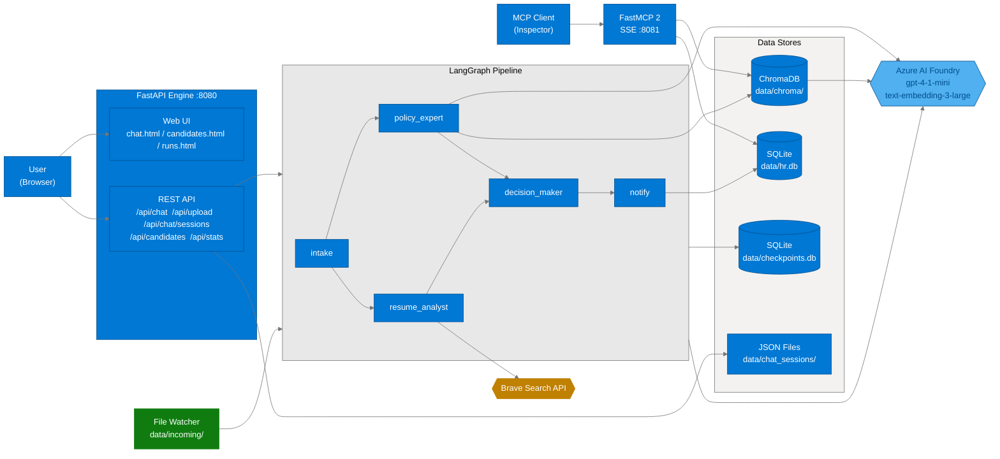
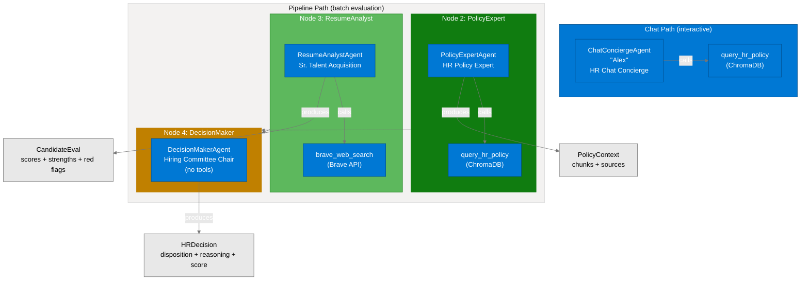
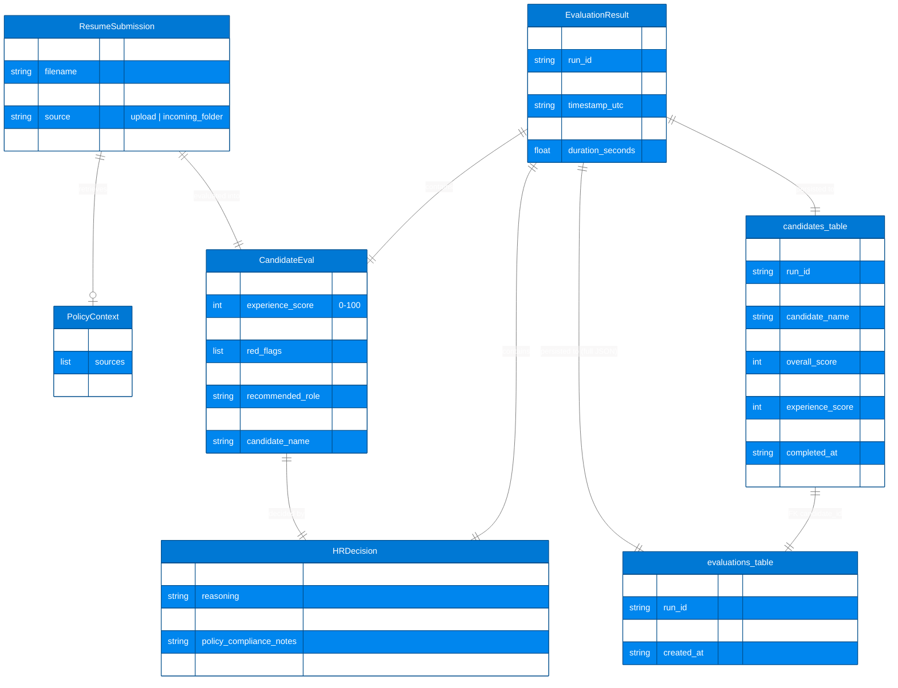
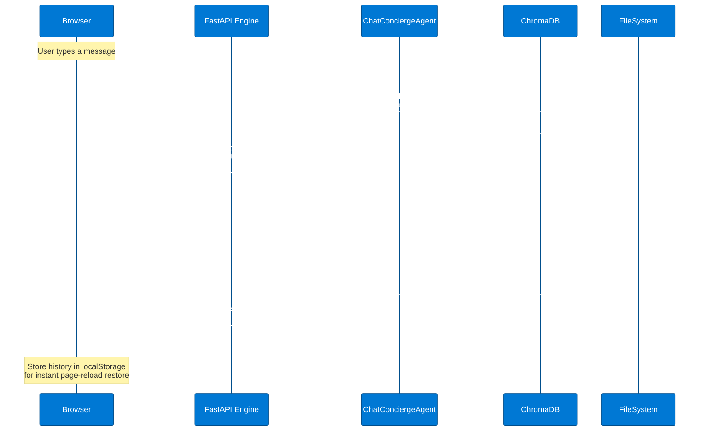
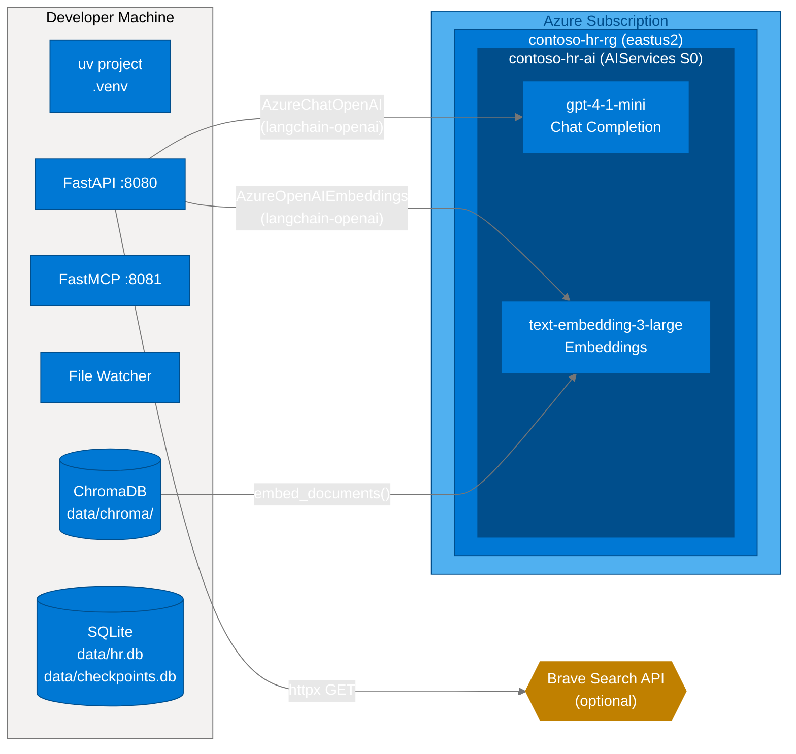
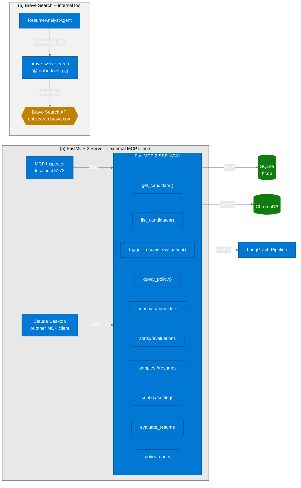

# Contoso HR Agent -- Architecture Deep Dive

**Last Updated:** 2026-03-29
**Project:** `contoso-hr-agent/` within the `agents2` repository
**Course:** O'Reilly *Build Production AI Agents*
**Purpose:** Screen Microsoft Certified Trainer (MCT) candidates using a multi-agent AI pipeline


---


## 1. System Overview

The Contoso HR Agent is a FastAPI application backed by a LangGraph pipeline that orchestrates four CrewAI agents. It accepts resumes via web upload or a watched folder, evaluates them against Contoso HR policy using RAG (ChromaDB) and optional web research (Brave Search), and produces a scored disposition.

### Diagram 1 -- Full System Architecture



**Key points:**

- The FastAPI engine serves the static web UI (chat.html, candidates.html, runs.html) and the REST API on port 8080. On startup it prints all 4 URIs: Web UI, API, Docs, MCP SSE.
- The file watcher is a separate process that polls `data/incoming/` and feeds resumes into the same LangGraph pipeline.
- The FastMCP 2 server on port 8081 exposes tools, resources, and prompts for MCP-compatible clients (e.g., MCP Inspector).
- All LLM and embedding calls route through Azure AI Foundry.


---


## 2. The Four Agents

The system uses four CrewAI agents, each defined as a class in `pipeline/agents.py` with `ROLE`, `GOAL`, `BACKSTORY`, and a `create()` classmethod.

| # | Agent Class | Persona | Context | Tools |
|---|-------------|---------|---------|-------|
| 1 | `ChatConciergeAgent` | "Alex" -- HR Chat Concierge | Interactive Q&A via `/api/chat` | `query_hr_policy` |
| 2 | `PolicyExpertAgent` | HR Policy Expert | Pipeline node 2 | `query_hr_policy` |
| 3 | `ResumeAnalystAgent` | Senior Talent Acquisition Specialist | Pipeline node 3 | `brave_web_search` |
| 4 | `DecisionMakerAgent` | Hiring Committee Chair | Pipeline node 4 | _(none -- pure reasoning)_ |

### Diagram 2 -- Agent Interaction



**Agent-tool mapping:**

- `query_hr_policy` -- wraps `knowledge/retriever.py`, performs semantic search against ChromaDB using Azure `text-embedding-3-large`. Shared by ChatConcierge and PolicyExpert.
- `brave_web_search` -- calls the Brave Search API via `httpx` for candidate/company verification. Used only by ResumeAnalyst. Gracefully degrades if `BRAVE_API_KEY` is not set.


---


## 3. LangGraph Pipeline

The pipeline is a `StateGraph` with five nodes and a parallel fan-out/fan-in pattern. All state is carried in `HRState` (a `TypedDict`). After `intake`, `policy_expert` and `resume_analyst` run **concurrently** (independent fan-out). Both must complete before `decision_maker` (fan-in). Each crew node creates a single-agent `Crew`, calls `kickoff()`, parses the JSON output, and merges it back into state. Parallel nodes return ONLY their own state keys so LangGraph can safely merge the two partial updates.

### Diagram 3 -- Pipeline State Machine

```mermaid
%%{init: {'theme':'base','themeVariables':{'primaryColor':'#0078D4','primaryTextColor':'#FFFFFF','primaryBorderColor':'#004E8C','lineColor':'#767676','secondaryColor':'#E8E8E8','tertiaryColor':'#F3F2F1'}}}%%
stateDiagram-v2
    [*] --> intake : ResumeSubmission
    intake --> fork_state : validated resume dict

    state fork_state <<fork>>
    fork_state --> policy_expert
    fork_state --> resume_analyst

    state join_state <<join>>
    policy_expert --> join_state : + PolicyContext, policy_meta
    resume_analyst --> join_state : + CandidateEval

    join_state --> decision_maker
    decision_maker --> notify : + HRDecision
    notify --> [*] : EvaluationResult

    state intake {
        [*] --> validate_resume
        validate_resume --> set_run_metadata
        set_run_metadata --> [*]
    }

    state policy_expert {
        [*] --> create_crew_pe
        create_crew_pe --> kickoff_pe
        kickoff_pe --> parse_json_pe
        parse_json_pe --> [*]
    }
    note right of policy_expert : Tool: query_hr_policy

    state resume_analyst {
        [*] --> create_crew_ra
        create_crew_ra --> kickoff_ra
        kickoff_ra --> parse_json_ra
        parse_json_ra --> [*]
    }
    note right of resume_analyst : Tool: brave_web_search

    state decision_maker {
        [*] --> create_crew_dm
        create_crew_dm --> kickoff_dm
        kickoff_dm --> parse_json_dm
        parse_json_dm --> [*]
    }
    note right of decision_maker : No tools (pure reasoning)

    state notify {
        [*] --> assemble_result
        assemble_result --> log_summary
        log_summary --> [*]
    }

    state error_handling {
        [*] --> error_result
        error_result --> [*]
    }
    note left of error_handling : Any node can set state["error"]
```

**Error handling:** If any node encounters an exception, it sets `state["error"]` and returns. Subsequent crew nodes short-circuit when `state.get("error")` is truthy. The `notify` node detects the error and assembles a minimal `EvaluationResult` with `decision="Needs Review"` and the error message in `red_flags`.

**Checkpointing:** `SqliteSaver` writes a checkpoint to `data/checkpoints.db` after each node transition. The `thread_id` in the LangGraph config corresponds to the `session_id` on the `ResumeSubmission`, enabling per-session state recovery.

**JSON extraction:** CrewAI agent output is free-form text. The `_extract_json()` helper tries three strategies in order: direct `json.loads`, markdown code block extraction, outermost brace extraction.


---


## 4. Data Models

All data contracts are Pydantic v2 models in `models.py`. The pipeline transforms data through a chain of progressively richer models.

### Diagram 4 -- Entity Relationship



**Data flow summary:**

```
ResumeSubmission (input)
  --> PolicyContext     (ChromaDB retrieval result)
  --> CandidateEval     (skills_match_score, experience_score, strengths, red_flags)
  --> HRDecision        (disposition + reasoning + overall_score)
  --> EvaluationResult  (final composite -- written to SQLite + JSON file + served by API)
```


---


## 5. Chat Memory Architecture

The ChatConciergeAgent ("Alex") maintains conversation context through a two-layer memory system. This enables multi-turn HR policy Q&A with context continuity across page refreshes and server restarts.

### Diagram 5 -- Chat Session Flow



**Two-layer persistence:**

| Layer | Storage | Survives | Access |
|-------|---------|----------|--------|
| Client-side | `localStorage` in browser | Page reload, tab close | Instant (no round-trip) |
| Server-side | `data/chat_sessions/{session_id}.json` | Browser clear, server restart | `GET /api/chat/history/{id}`, `DELETE /api/chat/history/{id}` |

**Context window:** The last 20 turns of conversation history are formatted as a transcript and injected into the CrewAI task description, giving the concierge agent conversational continuity.


---


## 6. Deployment Architecture

The system runs locally on the developer's machine. All LLM and embedding inference is offloaded to Azure AI Foundry. There is no cloud deployment of the application itself -- it is a course demo.

### Diagram 6 -- Azure Resources



**Environment variables (`.env`):**

| Variable | Purpose |
|----------|---------|
| `AZURE_AI_FOUNDRY_ENDPOINT` | Azure AI Foundry endpoint URL |
| `AZURE_AI_FOUNDRY_KEY` | API key for Azure AI Foundry |
| `AZURE_AI_FOUNDRY_CHAT_MODEL` | Chat deployment name (e.g., `gpt-4-1-mini`) |
| `AZURE_AI_FOUNDRY_EMBEDDING_MODEL` | Embedding deployment name (e.g., `text-embedding-3-large`) |
| `BRAVE_API_KEY` | Brave Search API key (optional -- degrades gracefully) |

**LLM integration pattern:** CrewAI agents use `LLM(model="azure/{deployment}", ...)` which routes through LiteLLM. LangChain nodes use `AzureChatOpenAI` directly. Embeddings use `AzureOpenAIEmbeddings`. All three share the same endpoint and API key.


---


## 7. MCP Integration

The system exposes an MCP (Model Context Protocol) server for tool-calling interoperability. A separate Brave Search integration is used internally by the ResumeAnalystAgent.

### Diagram 7 -- MCP Tool Calling



**FastMCP 2 server capabilities:**

| Type | Name | Description |
|------|------|-------------|
| Tool | `get_candidate(candidate_id)` | Full evaluation result for one candidate |
| Tool | `list_candidates(limit, decision_filter)` | Recent evaluations, optionally filtered |
| Tool | `trigger_resume_evaluation(resume_text, filename)` | Run the full pipeline synchronously |
| Tool | `query_policy(question)` | Semantic search against ChromaDB |
| Resource | `schema://candidate` | JSON schema for `EvaluationResult` |
| Resource | `stats://evaluations` | Aggregate evaluation statistics |
| Resource | `samples://resumes` | List of sample resume files |
| Resource | `config://settings` | Current app config (no secrets) |
| Prompt | `evaluate_resume` | Structured resume evaluation prompt |
| Prompt | `policy_query` | HR policy question prompt |

**Transport:** SSE (Server-Sent Events) at `http://localhost:8081/sse`. Connect via MCP Inspector at `http://localhost:5173` or configure in Claude Desktop's MCP settings.


---


## Appendix: Key File Index

| File | Purpose |
|------|---------|
| `src/contoso_hr/engine.py` | FastAPI app, all REST endpoints, chat session memory |
| `src/contoso_hr/pipeline/graph.py` | LangGraph `StateGraph`, `HRState`, 5 node functions, `create_hr_graph()` |
| `src/contoso_hr/pipeline/agents.py` | 4 CrewAI agent classes with `create()` factory methods |
| `src/contoso_hr/pipeline/tasks.py` | CrewAI `Task` factories that inject prior state into task descriptions |
| `src/contoso_hr/pipeline/tools.py` | `@tool query_hr_policy` (ChromaDB) + `@tool brave_web_search` (Brave API) |
| `src/contoso_hr/pipeline/prompts.py` | System prompts for all 4 agents |
| `src/contoso_hr/config.py` | `Config` dataclass, Azure AI Foundry LLM/embeddings factories |
| `src/contoso_hr/models.py` | Pydantic v2 model chain: `ResumeSubmission` through `EvaluationResult` |
| `src/contoso_hr/knowledge/vectorizer.py` | Ingest policy docs into ChromaDB with Azure embeddings |
| `src/contoso_hr/knowledge/retriever.py` | `query_policy_knowledge()` -- semantic retrieval from ChromaDB |
| `src/contoso_hr/memory/sqlite_store.py` | `HRSQLiteStore` -- `candidates` + `evaluations` tables |
| `src/contoso_hr/memory/checkpoints.py` | LangGraph `SqliteSaver` checkpointer helpers |
| `src/contoso_hr/watcher/resume_watcher.py` | Polls `data/incoming/` for new resume files |
| `src/contoso_hr/watcher/process_resume.py` | Orchestrates file-to-pipeline-to-persistence flow |
| `src/contoso_hr/mcp_server/server.py` | FastMCP 2 server with tools, resources, and prompts |
| `src/contoso_hr/util/port_utils.py` | `force_kill_port()` -- called on every startup |
| `src/contoso_hr/util/token_tracking.py` | Token usage tracking utilities |
| `src/contoso_hr/logging_setup.py` | Rich-based structured logging |
