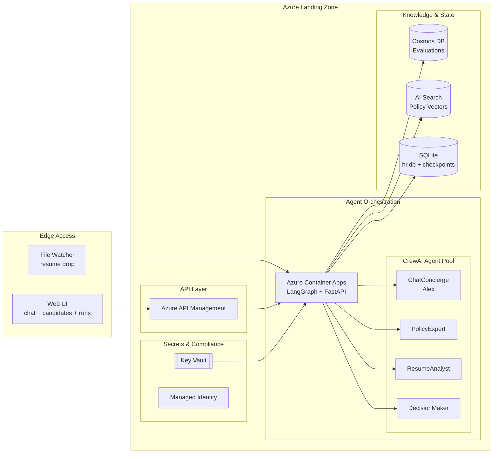

# Hour 4 Teaching Guide: Azure Deployment and Best Practices

**Goal:** Students understand the Azure production architecture for AI agents and review enterprise best practices for security, observability, cost, and testing.

**Time:** 60 minutes

**Active Project:** `contoso-hr-agent/` (the Contoso HR Agent for MCT resume screening)

---

## Opening (3 minutes)

**What We're Doing This Hour:**

1. Review Azure architecture for production AI agents
2. Deploy the Contoso HR Agent to Azure Container Apps
3. Configure Azure API Management (APIM)
4. Set up Azure Cosmos DB for state persistence
5. Integrate Azure AI Search (production-grade vector store)
6. Review enterprise best practices from research

**Key Message:** "Local development is great for learning. Production requires Azure services that scale, secure, and observe. The same parallel pipeline you saw in Hours 2-3 runs identically in the cloud."

---

## Azure Architecture Overview (10 minutes)

### The Production Architecture

**Show the Mermaid diagram:**



**Key point:** "The parallel pipeline (policy_expert and resume_analyst running concurrently) works the same in Azure as it does locally. LangGraph handles the fan-out/fan-in regardless of where it runs."

### Component Breakdown

| Component | Purpose | Why Azure? |
| --- | --- | --- |
| **Container Apps** | Runs the HR engine + pipeline | Serverless containers, auto-scale |
| **API Management** | Gateway, rate limiting | Enterprise security, analytics |
| **Cosmos DB** | Evaluation results, candidate data | Global distribution, low latency |
| **AI Search** | Policy vector store (replaces local ChromaDB) | Enterprise search, hybrid queries |
| **Key Vault** | Azure AI Foundry keys, Brave API key | Managed secrets, rotation |
| **MCP Server** | FastMCP 2 alongside the engine | External tool access for Claude/Copilot |

**Say:** "This is the same pipeline we built locally, but with Azure services handling scale, state, and security."

---

## Deploy to Azure Container Apps (15 minutes)

### Prerequisites

**Verify Azure CLI:**

```bash
az --version
az login
az account show
```

**Set variables:**

```bash
RESOURCE_GROUP="rg-contoso-hr"
LOCATION="eastus"
CONTAINER_APP_ENV="cae-contoso-hr"
CONTAINER_APP="ca-hr-engine"
ACR_NAME="acrcontosohr"
```

### Step 1: Create Resource Group (2 minutes)

```bash
az group create \
  --name $RESOURCE_GROUP \
  --location $LOCATION
```

### Step 2: Create Container Registry (3 minutes)

```bash
# Create registry
az acr create \
  --resource-group $RESOURCE_GROUP \
  --name $ACR_NAME \
  --sku Basic \
  --admin-enabled true

# Get credentials
ACR_PASSWORD=$(az acr credential show \
  --name $ACR_NAME \
  --query "passwords[0].value" -o tsv)
```

### Step 3: Build and Push Container (5 minutes)

**Create Dockerfile (if not exists):**

```dockerfile
FROM python:3.11-slim

WORKDIR /app

# Install uv
RUN pip install uv

# Copy project files
COPY pyproject.toml uv.lock ./
COPY src/ ./src/
COPY sample_knowledge/ ./sample_knowledge/
COPY web/ ./web/

# Install dependencies
RUN uv sync --no-dev

# Seed ChromaDB knowledge base
RUN uv run hr-seed

# Expose ports for engine and MCP
EXPOSE 8080 8081

# Run the FastAPI engine
CMD ["uv", "run", "hr-engine"]
```

**Build and push:**

```bash
az acr login --name $ACR_NAME

az acr build \
  --registry $ACR_NAME \
  --image contoso-hr-engine:v1 \
  --file Dockerfile \
  .
```

### Step 4: Deploy Container App (5 minutes)

**Create environment:**

```bash
az containerapp env create \
  --name $CONTAINER_APP_ENV \
  --resource-group $RESOURCE_GROUP \
  --location $LOCATION
```

**Deploy app:**

```bash
az containerapp create \
  --name $CONTAINER_APP \
  --resource-group $RESOURCE_GROUP \
  --environment $CONTAINER_APP_ENV \
  --image $ACR_NAME.azurecr.io/contoso-hr-engine:v1 \
  --registry-server $ACR_NAME.azurecr.io \
  --registry-username $ACR_NAME \
  --registry-password $ACR_PASSWORD \
  --target-port 8080 \
  --ingress external \
  --cpu 1 \
  --memory 2Gi \
  --min-replicas 0 \
  --max-replicas 5 \
  --secrets \
    "azure-key=$AZURE_AI_FOUNDRY_KEY" \
    "brave-key=$BRAVE_API_KEY" \
  --env-vars \
    "AZURE_AI_FOUNDRY_ENDPOINT=$AZURE_AI_FOUNDRY_ENDPOINT" \
    "AZURE_AI_FOUNDRY_KEY=secretref:azure-key" \
    "AZURE_AI_FOUNDRY_CHAT_MODEL=$AZURE_AI_FOUNDRY_CHAT_MODEL" \
    "AZURE_AI_FOUNDRY_EMBEDDING_MODEL=$AZURE_AI_FOUNDRY_EMBEDDING_MODEL" \
    "BRAVE_API_KEY=secretref:brave-key"
```

**Get the URL:**

```bash
az containerapp show \
  --name $CONTAINER_APP \
  --resource-group $RESOURCE_GROUP \
  --query properties.configuration.ingress.fqdn -o tsv
```

**Verify:** Open the URL in your browser -- you should see the same Chat page, Candidates page, and Pipeline Runs page as locally.

---

## Configure API Management (10 minutes)

### Why APIM?

- **Rate limiting:** Prevent abuse of the pipeline (LLM calls are expensive)
- **Authentication:** API keys, OAuth
- **Caching:** Reduce duplicate LLM calls for identical queries
- **Analytics:** Track usage, costs, response times
- **Transformation:** Request/response manipulation

### Create APIM Instance (3 minutes)

```bash
APIM_NAME="apim-contoso-hr"

az apim create \
  --name $APIM_NAME \
  --resource-group $RESOURCE_GROUP \
  --publisher-name "Contoso HR" \
  --publisher-email "admin@contoso.com" \
  --sku-name Consumption
```

**Note:** Consumption tier takes ~5 minutes to deploy.

### Add Rate Limiting Policy (4 minutes)

**In Portal -> API -> Inbound policies:**

```xml
<policies>
    <inbound>
        <base />
        <rate-limit calls="10" renewal-period="60" />
        <quota calls="100" renewal-period="86400" />
        <set-header name="X-Request-ID" exists-action="skip">
            <value>@(context.RequestId.ToString())</value>
        </set-header>
    </inbound>
    <backend>
        <base />
    </backend>
    <outbound>
        <base />
    </outbound>
</policies>
```

**Explain:**

- `rate-limit`: 10 calls per minute per subscription (protects LLM budget)
- `quota`: 100 calls per day
- `X-Request-ID`: Track requests for debugging pipeline runs

---

## Set Up Cosmos DB for State (8 minutes)

### Why Cosmos DB?

- **Evaluation results:** Query past candidate evaluations at scale
- **Chat sessions:** Persist chat history beyond local JSON files
- **Multi-region:** Global distribution for low latency
- **Replaces:** Local SQLite (hr.db) and JSON files (data/chat_sessions/)

### Create Cosmos Account (3 minutes)

```bash
COSMOS_ACCOUNT="cosmos-contoso-hr"

az cosmosdb create \
  --name $COSMOS_ACCOUNT \
  --resource-group $RESOURCE_GROUP \
  --kind GlobalDocumentDB \
  --default-consistency-level Session \
  --locations regionName=$LOCATION failoverPriority=0
```

### Create Database and Containers (3 minutes)

```bash
# Create database
az cosmosdb sql database create \
  --account-name $COSMOS_ACCOUNT \
  --resource-group $RESOURCE_GROUP \
  --name ContosoHR

# Container for candidate evaluations
az cosmosdb sql container create \
  --account-name $COSMOS_ACCOUNT \
  --resource-group $RESOURCE_GROUP \
  --database-name ContosoHR \
  --name Evaluations \
  --partition-key-path /candidate_id \
  --throughput 400

# Container for chat sessions
az cosmosdb sql container create \
  --account-name $COSMOS_ACCOUNT \
  --resource-group $RESOURCE_GROUP \
  --database-name ContosoHR \
  --name ChatSessions \
  --partition-key-path /session_id \
  --throughput 400
```

---

## Azure AI Search for Production RAG (7 minutes)

### Why AI Search Instead of ChromaDB?

| Feature | ChromaDB (local) | Azure AI Search |
| --- | --- | --- |
| Deployment | In-process | Managed service |
| Scale | Single instance | Auto-scale |
| Hybrid search | Vector only | Vector + keyword |
| Filters | Basic | Rich faceting |
| Security | None | RBAC, managed identity |
| Cost | Free | Pay-per-use (but managed) |

**Say:** "ChromaDB is great for development and this course. Azure AI Search is what you'd use in production for the policy_expert's knowledge base."

### Create AI Search Service (3 minutes)

```bash
SEARCH_NAME="search-contoso-hr"

az search service create \
  --name $SEARCH_NAME \
  --resource-group $RESOURCE_GROUP \
  --sku Basic \
  --partition-count 1 \
  --replica-count 1
```

### The Migration Path

**Local (this course):**

```text
sample_knowledge/ -> vectorizer.py -> ChromaDB -> query_hr_policy tool
```

**Production:**

```text
sample_knowledge/ -> Azure indexer -> AI Search -> query_hr_policy tool
```

**Key point:** The `query_hr_policy` tool interface stays the same. Only the retriever implementation changes. The pipeline, agents, and CrewAI code are unchanged.

---

## Best Practices Review (7 minutes)

### 1. Security First

| Practice | Implementation |
| --- | --- |
| **Secrets in Key Vault** | Azure AI Foundry keys, Brave API key -- never in code or env vars |
| **Managed Identity** | No credentials baked into containers |
| **Network isolation** | VNet for internal services |
| **Input validation** | Pydantic v2 models validate all pipeline inputs |

### 2. Observability

**Three pillars:**

1. **Logs:** Structured logging to Application Insights (pipeline node entries/exits)
2. **Metrics:** Scores, dispositions, latency per node, parallel branch timing
3. **Traces:** Distributed tracing across the parallel pipeline -- see both branches

**The runs.html page is your local version of this.** In production, Application Insights provides the same visibility at scale.

### 3. Cost Management

| Lever | Strategy |
| --- | --- |
| **Model selection** | gpt-4-1-mini for routine, gpt-4 for complex decisions |
| **Caching** | Cache policy queries that repeat across candidates |
| **Parallel execution** | Our fan-out pattern reduces wall-clock time (same token cost, faster results) |
| **Circuit breakers** | Stop runaway costs if a node loops or retries excessively |

### 4. Testing AI Systems

**Testing pyramid for agents:**

```text
           /\
          /  \
         / E2E \      <-- Full pipeline tests with sample resumes (few)
        /--------\
       /Integration\   <-- Agent interaction tests, ChromaDB queries (some)
      /--------------\
     /  Unit Tests    \ <-- Pydantic model validation, tool functions (many)
    /------------------\
```

**Key test types:**

- **Golden dataset:** Known resumes with expected dispositions
- **Property tests:** "DecisionMaker always returns one of four dispositions"
- **Regression tests:** Previously evaluated resumes still get correct results
- **Human eval:** Sample and review disposition reasoning manually

### 5. Guardrails and Safety

1. **Input validation:** Pydantic v2 ResumeSubmission validates all inputs
2. **Output validation:** EvaluationResult schema enforces structure
3. **Tool restrictions:** Agents only access their assigned tools (policy_expert cannot web search)
4. **Human-in-the-loop:** "Needs Review" disposition flags edge cases for human decision

---

## Wrap-Up and Q&A (5 minutes)

### What We Accomplished in 4 Hours

| Hour | Topic | Key Skills |
| --- | --- | --- |
| 1 | What is an Agent? | Claude Code, Copilot Studio, ReAct loop |
| 2 | Run, Test, Debug | Parallel pipeline, runs.html, VSCode debugging |
| 3 | MCP and Knowledge | FastMCP 2, MCP Inspector, ChromaDB, vibe coding |
| 4 | Azure Deployment | Container Apps, APIM, Cosmos, AI Search, best practices |

### Architecture Comparison

**Local (Hours 1-3):**

```text
Web UI -> FastAPI engine -> LangGraph parallel pipeline -> SQLite + ChromaDB
```

**Production (Hour 4):**

```text
APIM -> Container Apps -> LangGraph parallel pipeline -> Cosmos DB + AI Search
                                                          |
                                                     Key Vault (Secrets)
```

### Next Steps for Students

**Beginner:**

- Deploy the basic Container App
- Add one APIM policy (rate limiting)
- View logs in Application Insights

**Intermediate:**

- Add Cosmos DB persistence (replace SQLite)
- Implement model routing by candidate complexity
- Add a 5th agent to the parallel pipeline

**Advanced:**

- Full AI Search integration (replace ChromaDB)
- Custom evaluation metrics dashboard
- Multi-region deployment with traffic splitting

### Resources

**Azure Documentation:**

- [Container Apps](https://learn.microsoft.com/azure/container-apps/)
- [API Management](https://learn.microsoft.com/azure/api-management/)
- [Cosmos DB](https://learn.microsoft.com/azure/cosmos-db/)
- [AI Search](https://learn.microsoft.com/azure/search/)
- [Azure AI Foundry](https://learn.microsoft.com/azure/ai-services/)

**Framework Documentation:**

- [LangGraph](https://langchain-ai.github.io/langgraph/)
- [CrewAI](https://docs.crewai.com/)
- [FastMCP](https://github.com/jlowin/fastmcp)

---

## Teaching Tips

### If Azure Deployment Is Slow

**Prep ahead:**

- Pre-create APIM (takes 20+ minutes on Developer tier)
- Use Consumption tier for faster deployment
- Have screenshots ready for each step

### If Students Don't Have Azure Access

**Options:**

1. Demo on your screen while they follow along
2. Use Azure free tier ($200 credit)
3. Show architecture diagrams, skip deployment
4. Focus on best practices discussion

### If Running Behind

**Prioritize:**

1. Container Apps deployment (core)
2. Best practices review (critical concepts)
3. Skip APIM and Cosmos (can do later)

### If Students Are Advanced

**Challenges:**

1. "Add a custom domain and TLS to your Container App"
2. "Implement blue-green deployment with traffic splitting"
3. "Create a Bicep template for the entire architecture"
4. "Add a WebSocket endpoint for real-time pipeline run streaming"

---

## Quick Reference: Azure CLI Commands

**Deploy Container App:**

```bash
az containerapp create \
  --name $CONTAINER_APP \
  --resource-group $RESOURCE_GROUP \
  --environment $CONTAINER_APP_ENV \
  --image $ACR_NAME.azurecr.io/contoso-hr-engine:v1 \
  --target-port 8080 \
  --ingress external
```

**Get Container App URL:**

```bash
az containerapp show \
  --name $CONTAINER_APP \
  --resource-group $RESOURCE_GROUP \
  --query properties.configuration.ingress.fqdn -o tsv
```

**View logs:**

```bash
az containerapp logs show \
  --name $CONTAINER_APP \
  --resource-group $RESOURCE_GROUP \
  --follow
```

**Scale Container App:**

```bash
az containerapp update \
  --name $CONTAINER_APP \
  --resource-group $RESOURCE_GROUP \
  --min-replicas 1 \
  --max-replicas 10
```

---

## Final Checklist

Before ending the session, verify students can:

- [ ] Explain the parallel pipeline pattern (fan-out / fan-in)
- [ ] Describe the Azure architecture for the Contoso HR Agent
- [ ] Deploy a container to Azure Container Apps
- [ ] Understand APIM's role in production
- [ ] Describe when to use Cosmos DB vs SQLite, AI Search vs ChromaDB
- [ ] List 3 security best practices for AI agents
- [ ] Identify cost optimization strategies
- [ ] Access resources for continued learning

---

**Congratulations! You've taught production AI agents in 4 hours.**
